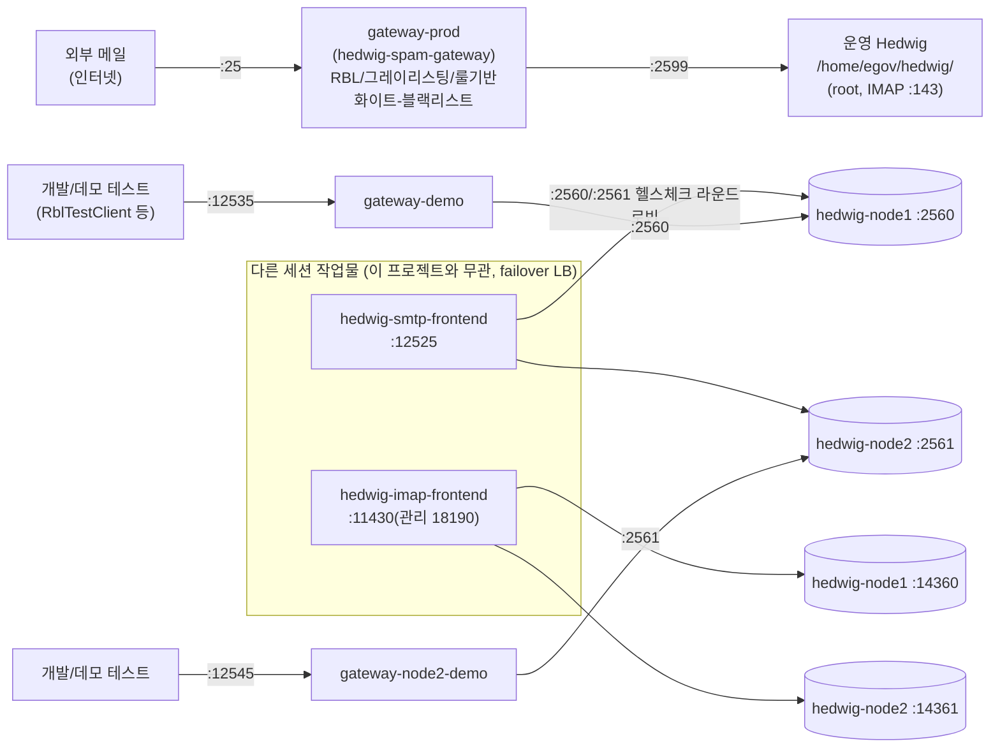

# Hedwig 스팸 게이트웨이 — 개발서버(egov) 실증 데모 시나리오

이 문서는 egov 개발서버(`10.30.9.146`, SSH alias `egov`)에 배포한 `hedwig-spam-gateway`를 대상으로,
RBL, 그레이리스팅, 룰기반 콘텐츠 필터(피싱 탐지), 화이트/블랙리스트, 관리자 대시보드 기능을
실제로 재현 가능한 순서로 시연하는 스크립트다.

## 0. 배포 구성

egov 개발서버에는 이 프로젝트가 만든 게이트웨이 인스턴스 3개와, 별도 세션이 만든 순수 LB(failover)
2개, 그리고 Hedwig 메일 서버 인스턴스 3개(운영 1 + 개발/테스트용 2)가 함께 떠 있다. 전체 그림은
"0-1. 전체 배포 구조" 절 참고.

### 이 프로젝트가 배포한 게이트웨이 인스턴스

| 인스턴스 | 용도 | SMTP 리슨 | 아웃바운드 리슨 | Actuator/관리자 | backend | 실행 경로 |
|---|---|---|---|---|---|---|
| `gateway-prod` | **실제 외부 메일 수신** (25번 포트) | `25` | `2526` | `18093` | `127.0.0.1:2599`(운영 Hedwig) | `/home/egov/hedwig_spam_prod/` |
| `gateway-demo` | node1(개발/테스트) 앞단 데모 | `12535` | `12536` | `18091` | `127.0.0.1:2560`(hedwig-node1) | `/home/egov/hedwig_spam/` |
| `gateway-node2-demo` | node2(개발/테스트) 앞단 데모 | `12545` | `12546` | `18092` | `127.0.0.1:2561`(hedwig-node2) | `/home/egov/hedwig_spam_node2/` |

세 인스턴스 모두 같은 레이아웃(`bin/`, `conf/`, `logs/`, `spool/`)과 같은 jar를 쓰며, 프로세스 식별용
`GATEWAY_PNAME`만 다르게 지정해 기동한다(`HEDWIG_SPAM_GATEWAY[_NODE2|_PROD]`). `gateway-prod`는
25번(및 실 backend인 143번 IMAP을 쓰는 운영 Hedwig 자체)이 privileged 포트라 `sudo`로 기동해야 한다.

- 설정 파일 원본: `deploy/conf/application.yml`(node1), `application-node2.yml`, `application-prod.yml`
- 로그 설정 원본: `src/main/conf/log4j2.xml` (세 인스턴스 모두 동일 파일을 복사해 사용)
- 시작/종료 스크립트 원본: `src/main/bin/start.sh`, `src/main/bin/stop.sh`
- 데모 도구: `deploy/PhishingDemoClient.java`, `deploy/RblTestClient.java`, `deploy/BlacklistDemoClient.java`
  (모두 서버에 `javac`로 컴파일해서 사용)
- H2 인메모리 DB를 사용하므로 **게이트웨이를 재시작하면 그레이리스팅/화이트-블랙리스트 데이터가 초기화**된다.

### start.sh/stop.sh 버그 수정 (2026-09-15)

`gateway-prod`를 25번 포트에 배치하며 `sudo`로 처음 기동해보다가 두 가지 실제 버그를 발견해 고쳤다.

1. **"already running" 오탐** — `ps -eaf | grep "$PNAME"`가 이 스크립트를 호출한 부모 셸 자신의
   커맨드라인(`GATEWAY_PNAME=... ./bin/start.sh` 같은 env-var 대입 형태로 `$PNAME` 문자열을 그대로
   포함)까지 매칭해버렸다. `stop.sh`에서는 이게 **부모 셸 자체를 kill**해 SSH 세션이 끊기는 사고로
   이어졌다. `"-D$PNAME"`(java의 `-D` 옵션 형태)로 매칭 패턴을 좁혀 해결.
2. **`sudo` 기동 시 프로세스가 몇 초 만에 소리없이 죽음** — 25/143 같은 privileged 포트를 바인딩하려면
   `sudo`가 필요한데, `sudo`가 명령마다 새로 할당하는 pty/세션이 정리되는 시점에 `nohup`만으로는
   백그라운드 자식까지 함께 끊기는 현상이 재현됐다. `nohup`+`disown` 대신 `setsid`로 완전히 새
   세션을 만들어 분리하도록 교체.

### node1 DATA 크래시 버그 수정 (2026-09-15)

### node1 DATA 크래시 버그 수정 (2026-09-15)

최초 시연 시 실 node1으로 DATA까지 진행하면 `354` 응답 직후 커넥션이 즉시 끊기는 문제를 발견했다
(게이트웨이 우회 직접 접속으로도 재현되어 게이트웨이 버그가 아님을 확인). `/home/egov/hedwig-node1/bin/app.console`의
스택트레이스로 근본 원인을 특정:

```
Exception in thread "smtp.taskExecutor-51" java.lang.NoClassDefFoundError:
    com/maxmind/geoip2/exception/AddressNotFoundException
    at com.hs.mail.smtp.processor.DataProcessor.doProcess(DataProcessor.java:74)
Caused by: java.lang.ClassNotFoundException: com.maxmind.geoip2.exception.AddressNotFoundException
```

`DataProcessor.doStartData()`가 `354` 응답 직후 `CountryResolverUtil.resolveByIp()`(발신 국가코드 판별,
`X-Sender-Country` 헤더용)를 호출하는데, `hedwig-server`의 `pom.xml`에는 `com.maxmind.geoip2:geoip2:2.16.1`
의존성이 선언되어 있지만 실제 node1/node2 배포판의 `lib/`에는 이 jar와 전이 의존성이 빠져 있었다.
`NoClassDefFoundError`는 `Error`라서 코드의 `catch (Exception e)`에 잡히지 않고 그대로 전파되어
DATA 처리 스레드가 죽으면서 클라이언트에 응답 없이 커넥션만 끊긴 것.

**조치**: 임시 pom으로 `mvn dependency:copy-dependencies`를 이용해 `geoip2` 런타임 의존성 전체
(geoip2-2.16.1, maxmind-db-2.0.0, httpclient-4.5.13, httpcore-4.4.13,
jackson-{annotations,core,databind}-2.13.0, 총 7개 jar)를 해석한 뒤 `/home/egov/hedwig-node1/lib/`와
`/home/egov/hedwig-node2/lib/`에 배포(두 노드의 `run.sh`가 `../lib/*.jar`를 자동으로 classpath에 포함하므로
스크립트 수정 불필요), `bin/run.sh restart`로 재기동. 재기동 후 두 노드 모두 직접 DATA 트랜잭션으로
`250 2.6.0 OK` 정상 응답 확인, `app.console`에 더 이상 관련 예외가 발생하지 않음을 확인했다.

이 수정 덕분에 이 데모의 backend를 임시로 썼던 FakeHedwig(`deploy/FakeHedwig.java`, 여전히 별도
격리 테스트용으로 유용해 저장소에는 남겨둠)에서 다시 **실 node1**으로 되돌렸다.

### GeoLite2-Country.mmdb 데이터 파일 배포 (2026-09-15)

위 jar 수정만으로는 크래시는 사라지지만, mmdb 데이터 파일 자체가 없어 `X-Sender-Country` 헤더는
TLD 기반 fallback으로만 채워지는 상태였다. MaxMind 라이선스 키를 발급받아
`https://download.maxmind.com/app/geoip_download?edition_id=GeoLite2-Country&license_key=...&suffix=tar.gz`
에서 최신 GeoLite2-Country DB(`GeoLite2-Country_20260911.tar.gz`)를 내려받아 압축 해제 후
`/opt/hedwig/geoip/GeoLite2-Country.mmdb`(코드 기본 경로, `sudo mkdir -p` + `chown egov:egov`)에 배포하고
두 노드를 재기동했다(`geoIpLoadAttempted` 플래그가 JVM 생명주기 동안 캐시되므로 파일을 나중에 놓으면
재기동해야 반영됨). MaxMind `DatabaseReader`를 직접 호출하는 별도 테스트로 `8.8.8.8 -> US` 정상 판별을
확인했다. 라이선스 키는 저장소/설정 파일에 남기지 않았으므로, DB 갱신이 필요하면 같은 방식으로
재다운로드해서 교체하면 된다(MaxMind는 주기적 갱신을 권장).

## 0-1. 전체 배포 구조 (egov 개발서버의 메일 관련 인스턴스 전체)

egov에는 이 프로젝트와 무관하게 다른 세션이 만든 순수 SMTP/IMAP LB(`hedwig-smtp-frontend`,
`hedwig-imap-frontend` — failover 목적, 스팸 필터링 없음)도 함께 떠 있다. 헷갈리지 않도록 전체를
한 그림으로 정리한다.



**요약**
- **운영 경로(실제 외부 메일)**: 인터넷 → `gateway-prod`(25번, 스팸 필터링 전부 적용) → 운영 Hedwig(2599번, IMAP은 그대로 143번).
- **개발/데모 경로**: `hedwig-node1`(2560)/`hedwig-node2`(2561)는 원래 운영 Hedwig를 9/8일에 복제해 만든
  격리된 사본이다. 이 프로젝트의 데모용 게이트웨이(`gateway-demo` 12535, `gateway-node2-demo` 12545)가
  각각 앞단에서 스팸 필터링 데모/검증에 쓰인다.
- **별도 LB(이 프로젝트 무관)**: `hedwig-smtp-frontend`(12525)/`hedwig-imap-frontend`(11430)는 다른
  세션이 만든 순수 failover 로드밸런서로, node1/node2 사이를 헬스체크 기반으로 라운드로빈한다. 스팸
  필터링 기능은 없으며 이 게이트웨이 프로젝트와 코드/설정 모두 독립적이다.

## 1. 서버 기동

배포 레이아웃은 Hedwig(`hedwig-node1/{bin,conf,lib,logs}`)과 동일하게 인스턴스마다
`bin/`(start.sh·stop.sh), `conf/`(application.yml·log4j2.xml), `logs/`(로그 파일)로 구성했다.
같은 호스트에 3개 인스턴스가 있으므로 **`GATEWAY_PNAME`을 인스턴스마다 다르게 지정**해야
`ps -eaf` 기반 프로세스 식별(시작/종료)이 서로 충돌하지 않는다.

```bash
ssh egov

# node1 데모 (일반 사용자로 기동 가능)
cd /home/egov/hedwig_spam
JAVA_HOME=/usr/lib/jvm/java-8-openjdk-amd64 ./bin/start.sh

# node2 데모
cd /home/egov/hedwig_spam_node2
GATEWAY_PNAME=HEDWIG_SPAM_GATEWAY_NODE2 JAVA_HOME=/usr/lib/jvm/java-8-openjdk-amd64 ./bin/start.sh

# 운영(25번 포트) - privileged 포트라 sudo 필수
cd /home/egov/hedwig_spam_prod
sudo GATEWAY_PNAME=HEDWIG_SPAM_GATEWAY_PROD JAVA_HOME=/usr/lib/jvm/java-8-openjdk-amd64 ./bin/start.sh
```

`logs/gateway.console`(또는 `logs/general.log`)에서 다음 라인으로 정상 기동을 확인한다.

```
SpamGatewayServer - 스팸 게이트웨이(gateway-demo) 리슨 시작: port=12535, reusePort=false, backend=127.0.0.1:2560
```

종료는 각 디렉터리에서 시작할 때와 동일한 `GATEWAY_PNAME`(및 필요 시 `sudo`)으로 `./bin/stop.sh` —
Hedwig `run.sh`와 동일하게 `-D<PNAME>` 프로세스를 `ps -eaf`로 찾아 정상 종료 후 필요 시 강제
종료한다(pid 파일 없음). 이미 실행 중이면 `start.sh`가 `is already running (pid=...)`을 출력하고
종료한다.

로그 파일/레벨은 `conf/log4j2.xml`을 직접 수정하면 재빌드 없이 반영된다(재시작 필요). Hedwig처럼
패키지별로 파일을 분리했다: `logs/{general,server,spamfilter,rbl,greylist,maillist,ban,outbound,jdbc}.log`.

## 2. RBL(DNSBL) 차단/통과

RFC 5782 표준 테스트 IP `127.0.0.2`는 `zen.spamhaus.org` 등 대부분의 DNSBL 테스트존에 항상 등재되어 있다.

```bash
java RblTestClient 12535 127.0.0.2   # 차단 확인용
java RblTestClient 12535 127.0.0.1   # 정상 통과 확인용
```

**결과**
- `127.0.0.2` → `connection closed immediately (no banner)` — RBL 등재 IP, 배너 전송 전 즉시 연결 종료
- `127.0.0.1` → `220 egov.handysoft.co.kr Service ready` — 정상 통과, backend 배너까지 중계됨

`logs/rbl.log`:
```
RblChecker - RBL 차단: ip=127.0.0.2, zone=zen.spamhaus.org
RblCheckHandler - RBL 등재 IP 연결 즉시 종료: ip=127.0.0.2
```

## 3. 그레이리스팅 DEFER → 재시도 통과

`(발신IP, MAIL FROM, RCPT TO)` 삼중항 기준으로 최초 시도는 항상 `450 4.2.1`로 지연시키고,
`min-retry-delay-minutes`(데모 설정: 1분) 경과 후 재시도하면 통과시킨다.

```bash
java PhishingDemoClient 12535   # 1차: RCPT TO에서 450 DEFER, DATA 진행 안 함
sleep 65
java PhishingDemoClient 12535   # 2차: RCPT TO 250, DATA까지 정상 진행
```

**1차 결과**
```
RCPT TO << 450 4.2.1 Please try again later
```
`logs/spamfilter.log`: `그레이리스팅 DEFER: ip=127.0.0.1, from=no-reply@slack.com, to=demo-target@handysoft.co.kr`
(그레이리스팅/화이트-블랙리스트/스팸 판정 로직이 모두 `InboundFilterFrontHandler` 한 클래스 —
패키지 `com.hs.mail.gateway.spamfilter.server` — 에서 처리되므로, `conf/log4j2.xml`의
`greylist.log`/`maillist.log`는 이 판정 로그를 받지 못하고 `spamfilter.log`로 모인다. 별도 파일로
분리하려면 로그 지점을 각 서비스 클래스로 옮기는 코드 변경이 필요하다.)

**2차 결과(65초 후)**
```
RCPT TO << 250 2.1.5 Recipient <demo-target@handysoft.co.kr> OK
DATA << 354 Start mail input; end with <CRLF>.<CRLF>
FINAL << 250 2.6.0 OK
```

## 4. 룰기반 피싱 탐지 + 헤더 태깅 (실측 사례 재현)

`PhishingDemoClient`가 보내는 본문은 실제 캡처된 피싱 메일(가짜 Slack 알림, `D:/slack.eml`) 패턴을
재현한 것이다 — 발신자는 `slack.com`인데 본문에 `outlook.com`(무료 메일) 주소가 노출되어 있다.
이 신호(`embedded-email-domain-mismatch`)는 실측 비교에서 Gemini만 잡아냈던 패턴을 규칙으로
재구현한 것으로, 단독으로 스팸 임계치를 넘도록 가중치가 설정되어 있다(`RuleBasedSpamChecker`).

2차 시도(그레이리스팅 통과 후) `logs/spamfilter.log`:
```
InboundFilterFrontHandler - 스팸 판정: score=0.5, reason=embedded-email-domain-mismatch:outlook.com
```

실 node1이 `250 2.6.0 OK`로 정상 수신 처리했으므로, `X-Spam-Flag`/`X-Spam-Score`/`X-Spam-Provider`
헤더가 주입된 메일이 실제로 backend에 전달·저장된 것이다. 룰기반 필터가 이미 확신하는 스팸이므로
LLM 호출 없이(비용 절감) 즉시 태깅해 전달했다.

주입된 헤더가 DATA 본문에 정확히 어떤 순서/형태로 붙는지 콘솔에서 직접 눈으로 확인하고 싶다면,
`deploy/FakeHedwig.java`(DATA 본문을 그대로 표준출력에 에코)를 backend로 임시 사용해도 된다
(`gateway.backend.port`를 FakeHedwig 포트로 바꾸고 재시작). 실측 결과는 다음과 같았다:

```
---- DATA CONTENT ----
DATA| X-Spam-Flag: YES
DATA| X-Spam-Score: 0.5
DATA| X-Spam-Provider: rule-based
DATA| Subject: OO님이 언급했습니다
DATA| From: Slack <no-reply@slack.com>
DATA| To: demo-target@handysoft.co.kr
DATA| 
DATA| 문의사항은 NadineEmerie6061@outlook.com 으로 연락 주세요.
---- END DATA ----
```

## 5. 화이트/블랙리스트 REST API + 블랙리스트 REJECT

```bash
curl -X POST http://127.0.0.1:18091/admin/mail-list \
  -H 'Content-Type: application/json' \
  -d '{"listType":"BLACK","pattern":"@known-spammer.example","reason":"demo blacklist"}'

curl -X POST http://127.0.0.1:18091/admin/mail-list \
  -H 'Content-Type: application/json' \
  -d '{"listType":"WHITE","pattern":"@trusted-partner.example","reason":"demo whitelist"}'

curl http://127.0.0.1:18091/admin/mail-list
```

등록 후 `@known-spammer.example` 발신자로 접속하면(`deploy/BlacklistDemoClient.java`):

```bash
java BlacklistDemoClient 12535
```

**결과** (`gateway.mail-list.blacklist-action: reject` 설정 시):
```
RCPT TO << 550 5.7.1 Blocked by sender blacklist
```

`blacklist-action: tag`로 바꾸면 거절 대신 `X-Spam-Flag: YES`만 태깅하고 backend로 전달한다.

## 6. 관리자 대시보드

```bash
curl -s -o /dev/null -w '%{http_code}\n' http://127.0.0.1:18091/admin/dashboard
```

`200` 응답 확인. 브라우저에서 `http://<egov-host>:18091/admin/dashboard`로 접속하면
RBL 차단 수, 그레이리스팅 DEFER/ALLOW 수, 스팸/정상 판정 수 등 현재 상태를 HTML로 볼 수 있다.

## 요약

| 기능 | 검증 결과 |
|---|---|
| RBL(DNSBL) 차단 | `127.0.0.2` 즉시 연결 종료, `127.0.0.1` 정상 통과 |
| 그레이리스팅 | 1차 DEFER(450) → 1분 후 재시도 ALLOW(250) |
| 룰기반 피싱 탐지 | `embedded-email-domain-mismatch` 단독으로 스팸 확정, `X-Spam-*` 헤더 주입 확인 |
| 블랙리스트 REJECT | 등록한 발신자 즉시 `550` 거절 |
| 화이트/블랙리스트 REST API | 등록/조회 정상 |
| 관리자 대시보드 | HTTP 200, HTML 정상 렌더링 |
| 운영(25번 포트) 실배치 | 운영 Hedwig를 2599로 이전 후 `gateway-prod`를 25번에 배치, RBL 차단/통과·SMTP 배너 중계 확인 |

시연 과정에서 발견해 수정한 버그들:
- node1/node2 GeoIP jar 배포 결함 → "0. 배포 구성 > node1 DATA 크래시 버그 수정" 절
- start.sh/stop.sh의 "already running" 오탐 및 sudo 데몬화 버그 → "0. 배포 구성 > start.sh/stop.sh 버그 수정" 절
